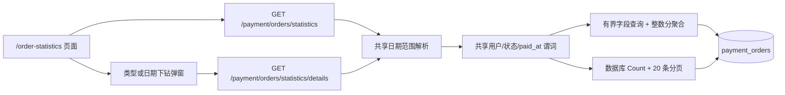

# 我的订单实付统计技术设计

## 设计目标

在不修改现有“我的订单”页面和列表 API 的前提下，为登录用户新增独立的人民币订单统计页。页面按浏览器自然日范围展示总实付、订单数、平均实付、三种订单类型聚合和每日聚合，并允许从类型行或日期行下钻查看只读订单明细。

需求和验收场景以 `openspec/changes/add-my-orders-payment-statistics/specs/payment/spec.md` 为唯一事实源。本文只定义实现边界、数据流、接口形状、状态管理和验证方法。

## 现有系统约束

- `payment_orders` 已保存 `user_id`、`pay_amount`、`payment_type`、`order_type`、`status` 和 `paid_at`，足够完成统计，无需 migration。
- `PaymentService` 直接持有 Ent client，现有订单查询和管理端统计也在 service 层构造 Ent query。
- 用户支付路由位于 `backend/internal/server/routes/payment.go`，通过 JWT 与用户模式 guard 统一保护。
- 前端 GET client 已自动注入 `Intl.DateTimeFormat().resolvedOptions().timeZone`，无需页面重复拼接时区。
- `/orders`、`UserOrdersView.vue` 和 `/payment/orders/my` 是高冲突且明确排除的既有表面，只做回归检查，不做实现修改。
- 站点统计口径固定为 CNY，不读取订单 provider snapshot 做币种推断，也不提供多币种 UI。

## 总体架构



汇总与下钻在路由和响应上分离，但复用同一个范围对象和基础谓词。这样可以保持汇总接口紧凑，也能保证下钻总数与被点击聚合行的订单数一致。

## 后端设计

### 文件边界

核心逻辑放入新的 `backend/internal/service/payment_order_statistics.go`，避免继续扩张订单创建和生命周期文件。建议在同文件定义：

- `OrderStatisticsQuery`：原始 `start_date`、`end_date`、`timezone`。
- `OrderStatisticsWindow`：规范化日期、`*time.Location`、`StartInclusive`、`EndExclusive`。
- `OrderStatisticsResponse`、`OrderStatisticsSummary`、`OrderTypeStatistics`、`DailyOrderStatistics`。
- `OrderStatisticsDetailsQuery` 与最小化 `OrderStatisticsDetail`。
- 日期解析、基础谓词、整数分转换和纯聚合函数。

handler 方法放入新的 `backend/internal/handler/payment_statistics_handler.go`，方法接收者仍为现有 `PaymentHandler`，不新增注入依赖。只需在 `payment.go` 追加两条静态路由。

测试优先使用新的同名 `_test.go` 文件；路由是否可达和是否受鉴权保护在现有 server contract 测试体系中追加最小覆盖。

### 日期范围模型

共享解析器接收原始 query 和可注入的 `now`，以便默认范围测试不依赖墙上时钟。处理顺序如下：

1. `timezone` 为空时使用 `timezone.Location()` 和 `timezone.Name()`；非空时必须经 `time.LoadLocation` 成功，禁止把显式非法值静默降级为站点时区。
2. 起止日期同时为空时，以有效时区的“今天”为结束日期，向前推 29 天得到包含今天的 30 个自然日。
3. 起止日期只提供一个时返回 `INVALID_ORDER_STATISTICS_RANGE`。
4. 使用 `time.ParseInLocation("2006-01-02", value, location)` 解析两端，校验顺序和包含首尾的天数不超过 366。
5. `StartInclusive` 为开始日 00:00，`EndExclusive` 使用结束日 `AddDate(0, 0, 1)`，不使用固定 24 小时，从而覆盖 DST 日长变化。

响应回显规范化后的 `start_date`、`end_date` 和有效 `timezone`。日期下钻先验证 `date` 位于已解析范围内，再以同一 location 构造该日的半开子区间。

### 共享订单谓词

基础谓词只包含以下条件：

```text
user_id = authenticated subject
status IN (PAID, RECHARGING, COMPLETED)
order_type IN (balance, usage_card, subscription)
paid_at IS NOT NULL
paid_at >= startInclusive
paid_at < endExclusive
```

`user_id` 只能由 `requireAuth` 得到，query DTO 不暴露该字段。类型下钻在基础谓词上追加合法的 `order_type`；日期下钻用该日本地时间子区间替换范围，但仍使用相同用户和状态条件。

建议由一个 `paidOrderStatisticsPredicates(userID, window)` helper 返回 Ent predicates，汇总和下钻均调用它，避免两个端点逐渐产生口径差异。

### 汇总查询与纯聚合

`GetUserOrderStatistics` 只选择聚合所需列：`id`、`pay_amount`、`order_type`、`paid_at`。查询上限由当前用户和最多 366 天控制，不加载用户、计划或 provider 关联。

纯聚合器初始化三种类型的零值桶，然后单次遍历订单：

1. 通过受测 helper 将每笔 `pay_amount` 四舍五入为 `int64` 分。
2. 累加总分、总订单数和对应类型桶。
3. 将 `paid_at` 转到 `window.Location` 后格式化为 `YYYY-MM-DD`，累加每日桶。
4. 最后把总额转换为两位小数，平均值按 `round(totalCents / count)` 得到整数分后转换。
5. 类型结果固定按 `balance`、`usage_card`、`subscription` 排列；每日结果按日期倒序。

聚合器只接受三种已支持类型。数据库若出现其他类型，该行不应悄悄进入总数并造成下钻不一致；查询层应把 `order_type IN (...)` 纳入共同条件，并通过测试锁定这一点。

### 汇总 API 契约

`GET /api/v1/payment/orders/statistics`

请求参数：

```text
start_date=2026-07-01
end_date=2026-07-20
timezone=Asia/Shanghai
```

成功数据：

```json
{
  "start_date": "2026-07-01",
  "end_date": "2026-07-20",
  "timezone": "Asia/Shanghai",
  "currency": "CNY",
  "summary": {
    "total_paid_amount": 368.50,
    "order_count": 6,
    "average_paid_amount": 61.42
  },
  "by_type": [
    { "order_type": "balance", "total_paid_amount": 200.00, "order_count": 2, "average_paid_amount": 100.00 },
    { "order_type": "usage_card", "total_paid_amount": 68.50, "order_count": 3, "average_paid_amount": 22.83 },
    { "order_type": "subscription", "total_paid_amount": 100.00, "order_count": 1, "average_paid_amount": 100.00 }
  ],
  "daily": [
    { "date": "2026-07-20", "total_paid_amount": 168.50, "order_count": 3, "average_paid_amount": 56.17 }
  ]
}
```

无订单时仍返回一个零值 `summary`、三行零值 `by_type` 和空 `daily`。金额使用 JSON number，与现有 payment 类型保持一致；前端负责 CNY 格式化。

### 下钻 API 契约

`GET /api/v1/payment/orders/statistics/details`

公共参数为 `start_date`、`end_date`、`timezone` 和 `page`，并且以下选择器恰好提供一个：

- 类型：`order_type=balance|usage_card|subscription`
- 日期：`date=YYYY-MM-DD`

页大小不作为外部可调参数，service 和响应固定为 20。查询先对同一 predicate 执行数据库 `Count`，再使用：

```text
ORDER BY paid_at DESC, id DESC
LIMIT 20 OFFSET (page - 1) * 20
```

成功数据沿用标准分页 envelope：

```json
{
  "items": [
    {
      "out_trade_no": "PAY-20260720ABC123",
      "order_type": "balance",
      "pay_amount": 100.00,
      "status": "COMPLETED",
      "payment_type": "alipay",
      "paid_at": "2026-07-20T08:15:30+08:00"
    }
  ],
  "total": 1,
  "page": 1,
  "page_size": 20,
  "pages": 1
}
```

明细 DTO 不复用完整 `PaymentOrderResult`，防止以后该对象新增字段时扩大统计端点暴露面。订单 ID 只用于数据库稳定排序，不返回前端；`out_trade_no` 本身唯一，可作为表格行 key。

### 错误映射

- 未认证由现有 `requireAuth` 返回 401。
- 日期、时区、范围、页码或选择器错误统一映射为带稳定 reason 的 400。
- Ent 查询错误包装上下文后由 `response.ErrorFrom` 映射为 500，日志不得包含订单明细。
- 空结果是 200，不是 404。

## 前端设计

### 组件边界

- `UserOrderStatisticsView.vue`：应用范围、汇总请求生命周期、页面布局和下钻选择。
- `OrderStatisticsAggregateTable.vue`：类型/每日两种列配置，提供整行点击、Enter/Space、可见焦点和稳定尺寸。
- `OrderStatisticsDetailsDialog.vue`：下钻标题、独立请求代次、20 条分页、加载/错误/空状态和关闭逻辑。
- `types/payment.ts`：汇总、聚合项、下钻 DTO 和 query 类型。
- `api/payment.ts`：`getOrderStatistics` 与 `getOrderStatisticsDetails`。

聚合表使用新组件而不改共享 `DataTable` 的交互语义，减少全局回归面；只读弹窗内部继续复用 `BaseDialog`、`DataTable`、`Pagination` 和现有 `OrderStatusBadge`。

### 页面结构

```text
页面标题                                        刷新
7 天 | 30 天 | 90 天       自定义开始日 - 结束日 | 查询

总实付金额                成功订单数               平均实付金额

类型聚合
余额     | ...                                           >
余额卡   | ...                                           >
订阅     | ...                                           >

每日统计
2026-07-20 | ...                                         >
2026-07-19 | ...                                         >
```

三个概要指标使用并列的小型卡片；两个表格是独立页面区段，不嵌套在卡片内。桌面三列展示指标，窄屏改为单列；聚合表和明细表在内容过宽时仅表格区域横向滚动。固定最小高度防止 loading、空状态和结果切换造成布局跳动。

按钮使用现有图标系统：刷新使用 refresh，行尾使用 chevron，弹窗关闭沿用 `BaseDialog`。侧边栏复用现有 `ChartIcon`，不增加新的手绘图标。

### 筛选状态机

页面维护两套日期状态：

- `draftRange`：用户正在编辑的自定义起止日期。
- `appliedRange`：当前汇总和下钻使用的范围。

初始 `appliedRange` 为本地最近 30 天并立即查询。选择 7/30/90 天时同时更新两套状态并立即查询。编辑自定义日期只改变 draft；点击查询后发出候选请求，只有该请求成功且仍是最新代次时才提交 applied。失败时保留原 applied 和原成功数据，同时显示可重试错误。

前端先做空值、反向和 366 天上限校验以快速反馈，后端仍执行相同校验作为权威边界。

### 请求竞态控制

汇总与弹窗各有独立的单调递增 request generation：

- 发起请求前记录本次 generation。
- 完成时只有 generation 仍等于当前值才写入 data/error/loading。
- 新范围、新下钻条件、翻页、重试和关闭弹窗都会推进对应 generation。
- 弹窗关闭或从类型切到日期时页码重置为 1，旧响应不能重新打开弹窗或覆盖新列表。

该方案不依赖 Axios cancellation 支持，测试可通过延迟 Promise 确定性验证。

### 展示与本地化

- 金额通过 `Intl.NumberFormat(locale, { style: 'currency', currency: 'CNY' })` 格式化，不手工拼接货币符号。
- 日期聚合键按后端返回的 `YYYY-MM-DD` 展示或基于字符串解析，禁止先按 UTC 构造 `Date` 导致日期偏移。
- `paid_at` 使用当前 locale 和浏览器时区格式化为日期时间。
- 三种订单类型、订单状态、支付方式、筛选/错误/空状态和弹窗标题均加入中英文文案。
- 类型行和每日行具有 `tabindex="0"`、可见焦点，并响应 Enter/Space；点击目标尺寸不低于 44px。

## 数据一致性与安全

- 客户端永远不能指定 `user_id`，两个 service 入口都要求由 handler 显式传入认证用户 ID。
- 汇总与下钻共享基础 Ent predicates，类型和日期下钻测试必须断言 `total == order_count`。
- 两个端点只读，不写订单、不触发 provider 查询、不读取退款字段。
- 手工站外退款不会改变订单原始 `pay_amount`，因此统计仍展示原始实付；这是已确认口径，不是数据修复缺陷。
- 固定 366 天范围限制汇总内存规模；下钻始终数据库分页，不允许前端请求全量。

## 测试策略

### 后端 TDD

- 范围解析表驱动测试：默认 30 天、单日、366 天、367 天、缺一端、反向范围、非法日期、非法/缺省时区。
- DST 测试至少覆盖一个 23 小时日和一个 25 小时日，断言使用相邻本地午夜而非固定 24 小时。
- 纯聚合测试：三种状态、三种类型、零值类型、每日倒序、小数分累计、平均舍入、空数据和不支持类型排除。
- 查询/handler 测试：当前用户隔离、非空 `paid_at`、认证来源、静态路由、最小 DTO、固定分页和 `paid_at/id` 稳定排序。
- 一致性测试：同一 fixture 下三种类型和各日期的聚合 count 分别等于下钻 total。

### 前端测试

- API 测试锁定两个路径、参数和响应类型使用方式。
- 页面测试覆盖默认 30 天、快捷范围立即查询、自定义 draft/applied、成功提交、失败保留旧范围、刷新和初始错误重试。
- 聚合表测试覆盖类型/日期整行点击、Enter、Space、零值类型行和每日倒序。
- 弹窗测试覆盖上下文标题、字段、固定 20 条分页、关闭重开、切换行、内部错误重试和空页。
- 用可控 Promise 覆盖汇总与弹窗的过期响应，确保晚到结果被忽略。
- 路由、侧边栏和 i18n 测试覆盖 payment feature flag、菜单激活和中英文 key 完整性。

### 完成前验证

- 后端：payment 相关 service、handler、server 测试，随后运行相关包 `go test -race` 和 `go vet`。
- 前端：相关 Vitest、`pnpm --dir frontend run lint:check`、`pnpm --dir frontend run typecheck`、`pnpm --dir frontend run build`。
- 规格：`openspec validate add-my-orders-payment-statistics --type change --strict --no-interactive`。
- 工作区：`git diff --check`，并确认 `UserOrdersView.vue` 和现有 `/payment/orders/my` 实现没有 diff。
- 视觉：在 1440px 和 375px 视口检查浅色/深色页面及明细弹窗，覆盖长订单号、长本地化文案、空状态和表格横向滚动。

## 发布与回滚

后端端点是纯新增且不改变旧契约，可以先于前端发布。前端发布后才出现路由和导航入口。回滚只需删除新增页面、组件、两个 handler/service 入口及追加的路由、导航和文案；不存在数据迁移或缓存失效步骤。
